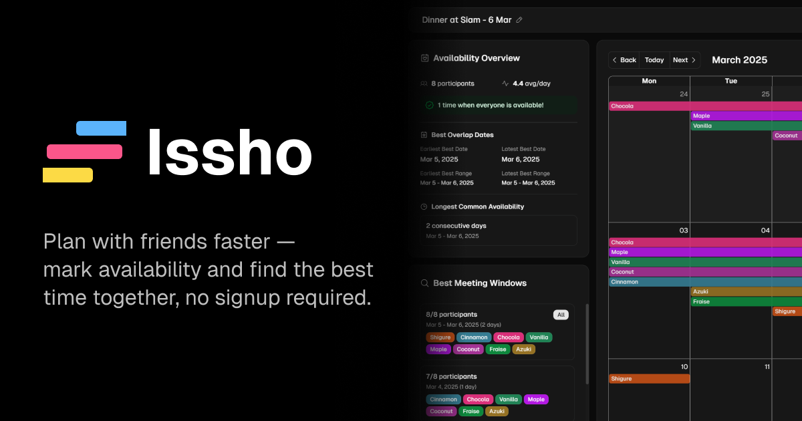

# Issho: Plan with friends, faster

<div align="center">
  <a href="https://codex.dulapahv.dev/">
    
  </a>
</div>

<br />

<div align="center">
  <a href="https://github.com/dulapahv/Issho/issues">
</div>

<br />

✨ **Try now at [issho.dulapahv.dev](https://issho.dulapahv.dev)**

Issho (一緒) means "together" in Japanese - and that's exactly what this app is about. It's a real-time collaborative calendar that lets you and your friends visually mark your availability and instantly find the perfect time to meet, without the endless back-and-forth messages, polls, or creating yet another account.

## Features

- **No Signup Required** - Start planning immediately
- **Visual Availability Marking** - Click and drag to mark when you're free
- **Real-time Collaboration** - See updates from friends instantly
- **Secure Sharing** - Share calendars with unique ID and PIN

## How It Works

1. **Create or Join** - Start a new calendar or join an existing one with ID & PIN
2. **Mark Availability** - Click and drag on dates when you're available
3. **Share with Friends** - Send the calendar ID and PIN to your group
4. **Find Common Time** - Instantly see when everyone is free!

## Tech Stack

- **Framework:** [Next.js 15](https://nextjs.org/)
- **Language:** [TypeScript](https://www.typescriptlang.org/)
- **Styling:** [Tailwind CSS 4.0](https://tailwindcss.com/)
- **UI Components:** [shadcn/ui](https://ui.shadcn.com/)
- **Database:** [PostgreSQL](https://www.postgresql.org/) via [Supabase](https://supabase.com/)
- **ORM:** [Prisma](https://www.prisma.io/)
- **Real-time:** [Supabase Realtime Broadcast](https://supabase.com/docs/guides/realtime/broadcast)
- **Calendar:** [React Big Calendar](https://github.com/jquense/react-big-calendar)
- **Bot Protection:** [Vercel BotID](https://vercel.com/docs/security/botid)
- **Deployment:** [Vercel](https://vercel.com/)

## Getting Started

### Project Structure

```txt
Issho
├── app/                           # Next.js app router
│   ├── api/                       # API routes
│   │   ├── calendar/              # Calendar endpoints
│   │   │   ├── create/            # POST: Create new calendar
│   │   │   ├── join/              # POST: Join existing calendar
│   │   │   └── [id]/              # Calendar-specific operations
│   │   │       ├── events/        # GET/POST/DELETE: Manage events
│   │   │       ├── rotate-pin/    # POST: Rotate calendar PIN
│   │   │       └── update/        # PATCH: Update calendar details
│   │   └── cron/                  # Scheduled jobs
│   │       └── cleanup-calendars/ # Clean up old calendars
│   ├── calendar/                  # Calendar pages
│   │   └── [id]/                  # Dynamic calendar view
├── components/                    # React components
│   └── ui/                        # shadcn/ui components
├── lib/                           # Utility functions and services
│   └── supabase/                  # Supabase configuration
├── prisma/                        # Database configuration
├── public/                        # Static assets
└── package.json                   # Dependencies and scripts
```

### Prerequisites

- Node.js 18+
- pnpm (recommended) or npm
- Supabase account (free tier works)

### Installation

1. Clone the repository:

   ```bash
   git clone https://github.com/dulapahv/issho.git
   cd issho
   ```

2. Install dependencies:

   ```bash
   pnpm install
   ```

3. Copy environment variables:

   ```bash
   cp .env.example .env.local
   ```

4. Set up Supabase:

   - Create a new project at [app.supabase.com](app.supabase.com)
   - Copy your project URL and anon key to `.env.local`
   - Copy database connection strings to `.env.local`

5. Set up the database:

   ```bash
   pnpm prisma generate
   pnpm prisma db push
   ```

6. Run the development server:

   ```bash
   pnpm dev
   ```

Open <http://localhost:3000> to see the app.

## Usage

### Creating a Calendar

1. Visit the website
2. Click "Create Calendar"
3. Start marking your availability
4. Share the invite link with friends

### Joining a Calendar

Click an invite link or enter the ID and PIN received from a friend!

### Marking Availability

- **Add Availability:** Select "Mark Available" and drag across dates
- **Remove Availability:** Select "Delete Available" and drag across dates
- **Edit Calendar Name:** Click on the calendar name in the top bar

## Contributing

Contributions are welcome!

### Development

```bash
# Run development server (with Turbopack)
pnpm dev

# Build for production (with Turbopack)
pnpm build

# Run production build
pnpm start

# Linting and formatting
pnpm lint:check       # Run ESLint check
pnpm lint:fix         # Fix ESLint issues
pnpm format:check     # Check formatting with Prettier
pnpm format:fix       # Fix formatting with Prettier

# Database commands
pnpm db:push          # Push schema changes to database
pnpm db:generate      # Generate Prisma client
pnpm db:migrate       # Run database migrations
pnpm db:studio        # Open Prisma Studio
```

### Environment Variables

```env
# Supabase
NEXT_PUBLIC_SUPABASE_URL=your_supabase_url
NEXT_PUBLIC_SUPABASE_ANON_KEY=your_anon_key

# Database (for Prisma)
DATABASE_URL=your_database_url
DIRECT_URL=your_direct_url

# Cron
CRON_SECRET=your_cron_secret
```

## License

This project is licensed under the Apache-2.0 License - see the [LICENSE](/LICENSE) file for details.

## Author

**Dulapah Vibulsanti**

- Website: [dulapahv.dev](https://dulapahv.dev)
- GitHub: [@dulapahv](https://github.com/dulapahv)

## Acknowledgments

- [React Big Calendar](https://github.com/jquense/react-big-calendar) for the calendar component
- [Supabase](https://supabase.com/) for the backend infrastructure
- [Vercel](https://vercel.com/) for hosting and bot protection
- [shadcn/ui](https://ui.shadcn.com/) for UI components

## Support

For support, please [open an issue](https://github.com/dulapahv/Issho/issues) or contact me at [dulapahv.dev/contact](https://dulapahv.dev/contact).
